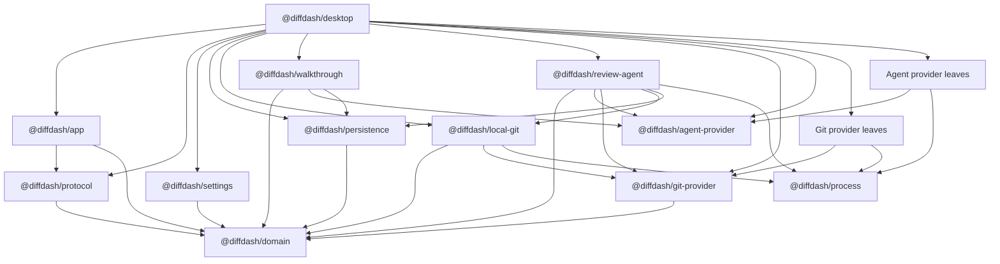

# Architecture

DiffDash is a pnpm workspace with one Electron composition root. Package boundaries separate domain,
platform, host orchestration, and concrete integrations; they are enforced by
`scripts/build/package-boundaries.test.mjs`.

## Package Graph

Arrows point from a consumer to an allowed dependency. External libraries are omitted.

`@diffdash/e2e` is a product-test leaf that launches compiled or packaged `@diffdash/desktop`.
`@diffdash/web` is an independent web product. `tools/*` consumes browser-safe product exports for
demo and promotional output but is never shipped in the desktop application.

## Allowed Directions

- `@diffdash/domain` is the lowest product model layer and imports no platform or provider package.
- `@diffdash/protocol` depends only on browser-safe domain contracts and Effect. It never imports
  Electron, Node, persistence, or a concrete provider.
- `@diffdash/app` is browser-safe. Renderer code reaches privileged capabilities only through the
  typed protocol implemented by preload.
- `@diffdash/process`, `@diffdash/settings`, and `@diffdash/persistence` own subprocess, JSON, and
  SQLite infrastructure respectively. Process execution is exposed as one scoped Effect service;
  concrete command protocols remain outside the package. Electron supplies paths and layers at the
  application edge.
- `@diffdash/git-provider` and `@diffdash/agent-provider` own provider-neutral contracts,
  registries, errors, and conformance suites. They never import concrete providers.
- Concrete provider packages are inward-facing leaves. They may depend on their SDK, Effect,
  `@diffdash/process` when needed, and provider-owned libraries. They never depend on desktop,
  renderer, protocol, settings, persistence, orchestration, or another concrete provider.
- Provider-neutral orchestration may depend on SDKs and infrastructure, but not concrete providers.
- `@diffdash/desktop` is the only composition root. Concrete Git providers are registered in
  `packages/desktop/electron/main/composition.ts`; concrete agent providers are registered in
  `packages/desktop/electron/main/agent-provider-composition.ts`.

Dependencies must remain acyclic and use `workspace:*`. Relative imports cannot cross package
roots. Browser-safe exports are bundled in a browser target during the boundary test to reject Node,
Electron, SQLite, and concrete-provider leakage.

## Runtime Trust Boundary

Providers are built into DiffDash and reviewed and released with the desktop application. A package
boundary is an ownership, test, and dependency boundary, not runtime sandboxing. Concrete provider
code executes as trusted code in the Electron main process and can use capabilities explicitly
passed by desktop composition. Do not treat the package model as safe plugin loading for untrusted
third-party code.

See [Git provider authoring](git-provider-authoring.md) and
[agent provider authoring](agent-provider-authoring.md) for extension contracts.
