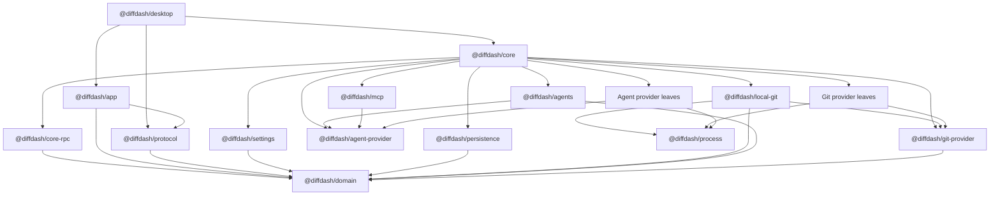

# Architecture

DiffDash is a pnpm workspace with an Electron native host and one authenticated external Core
business process. Package boundaries separate domain, platform, host orchestration, and concrete
integrations; they are enforced by
`scripts/build/package-boundaries.test.mjs`.

## Package Graph

Arrows point from a consumer to an allowed dependency. External libraries are omitted.

```mermaid
graph TD
  desktop["@diffdash/desktop"] --> core["@diffdash/core"]
  desktop["@diffdash/desktop"] --> app["@diffdash/app"]
  desktop --> protocol["@diffdash/protocol"]
  core --> settings["@diffdash/settings"]
  core --> persistence["@diffdash/persistence"]
  core --> localGit["@diffdash/local-git"]
  core --> agents["@diffdash/agents"]
  core --> mcp["@diffdash/mcp"]
  core --> gitSdk["@diffdash/git-provider"]
  core --> agentSdk["@diffdash/agent-provider"]
  core --> coreRpc["@diffdash/core-rpc"]
  core --> gitProviders["Git provider leaves"]
  core --> agentProviders["Agent provider leaves"]
  coreRpc["@diffdash/core-rpc"] --> domain["@diffdash/domain"]

  app --> protocol
  app --> domain["@diffdash/domain"]
  protocol --> domain
  settings --> domain
  persistence --> domain
  localGit --> domain
  localGit --> gitSdk
  localGit --> process["@diffdash/process"]
  agents --> domain
  agents --> agentSdk
  mcp --> agentSdk
  gitSdk --> domain
  gitProviders --> gitSdk
  gitProviders --> process
  agentProviders --> agentSdk
  agentProviders --> process
```

`@diffdash/e2e` is a product-test leaf that launches compiled or packaged `@diffdash/desktop`.
`@diffdash/web` is an independent web product. `tools/*` consumes browser-safe product exports for
demo and promotional output but is never shipped in the desktop application.

## Allowed Directions

- `@diffdash/domain` is the lowest product model layer and imports no platform or provider package.
- `@diffdash/protocol` depends only on browser-safe domain contracts and Effect. It never imports
  Electron, Node, persistence, or a concrete provider.
- `@diffdash/core-rpc` owns runtime-neutral native Effect RPC declarations shared by Core and the
  external-Core Electron client. The contract package depends only on approved domain contracts and
  Effect, and never imports renderer
  IPC, host, persistence, settings, or runtime adapters. Effect owns RPC correlation and
  serialization; DiffDash annotations add application identities, logical budgets, and lifecycle
  policy.
- `@diffdash/app` is browser-safe. Renderer code reaches privileged capabilities only through the
  typed protocol implemented by preload.
- `@diffdash/process`, `@diffdash/settings`, and `@diffdash/persistence` own subprocess, JSON, and
  SQLite infrastructure respectively. Persistence stores require Effect's generic `SqlClient`;
  runtime-specific Node and Bun adapters own SQLite startup, backup, and migrations. Process
  execution is exposed as one scoped Effect service; concrete command protocols remain outside the
  package. Electron supplies schema-validated plain runtime configuration at the Core boundary.
- `@diffdash/git-provider` and `@diffdash/agent-provider` own provider-neutral contracts,
  registries, errors, and conformance suites. They never import concrete providers.
- `@diffdash/agents` owns provider-neutral walkthrough and review-thread engines. Its two explicit
  exports depend only on `@diffdash/agent-provider`, `@diffdash/domain`, and Effect; Core supplies
  resolved provider context and retains routing, persistence, target resolution, workspace leases,
  MCP access, progress, and transaction ownership.
- `@diffdash/mcp` is the sole MCP SDK owner. It exposes loopback HTTP lifecycle, scoped bearer
  capabilities, request decoding, tool registration, bounded output, and cleanup, while Core supplies
  a typed handler bundle. It never imports persistence, process, local-git, Core, or review-domain
  implementation services.
- Concrete provider packages are inward-facing leaves. They may depend on their SDK, Effect,
  `@diffdash/process` when needed, and provider-owned libraries. They never depend on desktop,
  renderer, protocol, settings, persistence, orchestration, or another concrete provider.
- Provider-neutral orchestration may depend on SDKs and infrastructure, but not concrete providers.
- `@diffdash/core` owns the single business runtime, service Layer graph, and concrete
  provider registration, review-thread anchor mapping, prompt construction, artifact normalization,
  deterministic review ordering, and offset pagination. Its public `core.ts` entrypoint is an
  export-only facade; internal code depends on the closed `core-contract.ts` leaf instead of
  importing the public entrypoint. Core imports no Electron, updater, renderer, or desktop modules.
- `@diffdash/desktop` owns windows, preload security, dialogs, shell integration, the updater,
  single-instance behavior, external Core process supervision, and the native RPC client.

The desktop build has two explicit main-process composition roots. Normal `build`, `pack`, and
`dist` tasks select the production entrypoint, which contains no E2E environment-controlled policy
or fixture providers. Playwright tasks select the `e2e` build mode and its separate entrypoint,
which may decode `DIFFDASH_E2E_*` values and composes Core's fixture-provider export. The E2E
entrypoint and fixture provider implementations are not reachable from the production main bundle.
The same fail-closed mode selection produces a deterministic standalone `core.mjs` and bounded
manifest. Desktop embeds the bundle-derived build identity, while electron-builder copies the exact
artifact to `resources/core` outside ASAR. Production graph tests reject fixture providers from the
production Core artifact.

Dependencies must remain acyclic and use `workspace:*`. Relative imports cannot cross package
roots. Browser-safe exports are bundled in a browser target during the boundary test to reject Node,
Electron, SQLite, and concrete-provider leakage.

## Source Surface Capability Boundary

Code files, review diffs, and source previews are source surfaces. `@diffdash/app` owns one source
surface kernel that is the sole integration point for Pierre render lifecycle, delegated
interactions, line selection, decorations, and durable floating-pane anchors. A narrow private
Review adapter retains Pierre's side-aware gutter payload for protected thread interactions; that
payload is not exposed as a capability or extension contract. Built-in Git,
language navigation, search, review navigation, and viewed-file behavior register named
capabilities with that kernel instead of composing Pierre callbacks directly.

The same capability contracts are the intended boundary for future user-owned extensions, but the
renderer runtime is not itself an extension sandbox. User code must eventually execute outside the
renderer and communicate through versioned, schema-validated, serializable provider and
contribution protocols. DOM nodes, React components, Pierre instances/options, Electron APIs, and
raw input events are never extension API. See
[Source surface capabilities](source-surface-capabilities.md) for ownership rules, current built-in
adoption, and the extension-host target.

## Runtime Trust Boundary

Providers are built into DiffDash and reviewed and released with the desktop application. A package
boundary is an ownership, test, and dependency boundary, not runtime sandboxing. Concrete provider
code executes as trusted code in the external Core and can use capabilities explicitly passed by
Core composition. Do not treat the package model as safe plugin loading for untrusted third-party
code.

## External Core Boundary

Electron controllers call literal typed RPC methods through one shared native client. Internal
Effect tags, Layers, product SQLite, providers, and business services are not exposed to Electron.
Boundary tests reject direct business-service imports, renderer access to Core RPC, generic runtime
execution, and any application `ManagedRuntime`.

Native Effect
RPC middleware enforces process identity, ready-only business admission, method deadlines, and
cancellation policy before invoking Core handlers. The bounded walkthrough protocol enforces each
method's logical MessagePack request and response limits before the 512 KiB native frame ceiling,
rejects duplicate live request IDs, and retains at most 32 full-frame reservations. Timed-out
uninterruptible cancellations remain owned by a scoped, 32-fiber Core set instead of escaping into a
global runtime. `CoreLifecycle` owns the authoritative admission and drain decision; method-specific
middleware maps it to exact wire failures without adding a custom dispatcher or transport envelope.
Control RPCs remain callable according to their own bootstrap and shutdown lifecycle rules.
Core privately merges the disjoint control and business audiences into one scoped, transport-neutral
`RpcServer`. The external host uses the native Unix socket protocol with
bounded MessagePack input, a private `0700` runtime directory, and a `0600` socket. A one-time redacted
credential carried in native RPC headers atomically binds the first authenticated Effect client ID;
wrong credentials do not consume it, and no later connection can authenticate even after disconnect.
Authentication advances the existing public lifecycle from `starting` to `awaitingOwnership`, while
socket listening, connection, and host-side epoch verification remain private transport states.
Electron owns a scoped native client and independently rejects a health value that does not identify
the exact launched application instance and process epoch. Real socket integration proves native
disconnect scope cleanup and process-owned request lifetimes.

The Electron host coordinator owns one memoized bootstrap acquisition per application
scope. It creates a fresh short private runtime directory, process epoch, request ID, and redacted
one-time token. Before creating the transport, Desktop schema-decodes a bounded build manifest,
requires the exact Desktop build identity and utility/Bun runtime contract, and verifies the
canonical outside-ASAR `core.mjs` SHA-256 and file identity. The coordinator revalidates that identity
immediately before invoking the scoped Electron `utilityProcess` launcher. The child decodes one
bounded environment envelope, immediately redacts its credential, composes the real file-backed app
state service without acquiring SQLite, and binds the existing authenticated socket host. Electron
waits for either the private socket or early process exit, then builds the native client and completes
authenticated health and exact epoch verification. Its private state sequence is `idle ->
preparingRuntime -> transportListening -> authenticating -> epochVerified -> awaitingOwnership`.
Concurrent and repeated starts share one session. Any failure or scope closure terminates the child,
closes client and launcher resources, removes the runtime directory, and exposes only a stage plus
fixed safe message; the socket path and token are not retained in the returned session or public
failure. Core alone acquires product SQLite after explicit ownership authorization; Electron never
opens it.

Core also owns the disposable-resource catalog and the one active repository watcher. Snapshot
blocks, managed spools, process temporary data, and generated local/remote worktree pools are
registered under typed roots; policy collection cannot bypass foreground or durable-operation leases
and cannot touch unknown older artifacts. Agent execution atomically leases both its generated
worktree and parent bare repository. Scoped review staging remains producer-owned, while SQLite
migration backups remain database-recovery artifacts rather than independently collectible cache
entries. Review operations open their own bounded snapshot-reader lease, so a renderer disconnect or
project switch does not invalidate accepted walkthrough or agent work. Native watch hints are lossy
accelerators only: debounced hints, focus/resume/overflow triggers, and polling all converge through
canonical Git reconciliation before a generation-keyed state event is published.

The host must call `start` before any business operation. Concurrent and repeated startup calls
share one acquisition, startup failures are normalized at the native boundary, and disposal closes
the RPC client, supervised process, socket, and private runtime directory. Electron installs graceful
shutdown ownership before Core startup so partial startup is still disposed.

Native-host configuration is schema-decoded once. Optional paths, environment values, fixtures,
repository lookups, and cached artifacts use `Option` inside Core and persistence. Existing Electron,
IPC, SQLite, and encoded configuration contracts remain nullable only at their boundaries. Analytics
and fixture availability use closed states rather than independent nullable or boolean fields.

### Effect-Neutral Process Boundaries

Every process seam carries encoded data rather than Effect runtime values. Core RPC servers encode
through each declaration's JSON codec before MessagePack transport, and the generated Electron-main
client performs the only Core RPC domain decode. Electron main accepts that main-owned domain value
or fails the operation; it never revives, normalizes, or structurally repairs foreign `Option`, schema
classes, errors, or other Effect values.

The renderer treats the context-bridged `DiffDashApi` as an encoded transport, not an application
service. One internal `PreloadClient` owns `window.diffDash`; renderer features depend on cohesive
Effect services for repositories, project targets, preferences, review content, review automation,
and Electron-shell capabilities. Preload validates the encoded side of each channel schema and passes
only an `EncodedBridgeResult` through `contextBridge`; it must not decode domain classes or `Option`
before that boundary. Their independent Layers are composed once into one atom-owned runtime. The
renderer adapters perform the single domain decode, restore ordinary absence as `Option`, translate
callback subscriptions into scoped streams, and expose typed renderer failures. A package boundary
test rejects direct bridge access from production feature code.

Electron bridge encodings may use structured-clone-safe native binary leaves such as `Uint8Array`;
they are not restricted to JSON. Effect-owned objects are never valid encoded leaves. New transformed
or binary contracts require a round-trip test at the owning process seam. Schema mismatches fail with
the boundary stage and channel in the public transport error instead of activating compatibility
recovery.

Core operations return owner-domain failures, not `TransportError`. Electron maps those failures to
the established public IPC codes at the controller boundary. Conversely, unsolicited updater,
thread-progress, window, and navigation events use one checked best-effort sender: encoding and
payload violations remain visible, while a renderer destroyed during delivery cannot fail the
owning workflow.

Review acquisition returns immutable identity, source detail, and a file count only. It never sends
raw patches, parsed diffs, or complete file inventories across the host boundary. The renderer opens
that identity as a progressive session, pages file metadata through `Reviews.inventory`, and reads
content only through bounded legal ranges. Durable review operations open independent bounded
readers, so neither operation correctness nor snapshot reachability depends on renderer residency.

| Ownership | Current boundary |
| --- | --- |
| Repositories, project workspace, settings, prerequisites, analytics | Named Core operations |
| Review metadata acquisition, paged inventory/ranges, search, viewed state, navigation resolution | Named Core operations |
| Review agents and threads | Named Core operations with host progress callbacks |
| Walkthrough execution and persistence | `start`, `getOperation`, `cancel`, and `getStored` |

SQLite is authoritative for accepted, active, and terminal walkthrough operations. Core persists
acceptance before provider execution, uses guarded state versions to choose one terminal winner, and
loads successful content from `WalkthroughStore` through the persisted artifact reference. The
scoped `FiberMap<WalkthroughOperationId>` contains active workers only; completed fibers leave it
automatically, and no terminal `Deferred` registry or fixed in-memory history limit exists. Repeated
non-regenerate starts attach to the persisted exact review generation and prompt version, while
regeneration durably supersedes matching prior work. Startup marks active rows from a dead Core epoch
as interrupted and never restarts provider work automatically.

Updater, window, dialog, shell, IPC sender validation, and renderer transport remain Electron-owned.
FUN-254 continues with renderer-visible replay and cross-process diagnostics without moving
orchestration back into Electron.

Core classifies business failures before they cross RPC. Electron's generic IPC projection consumes
only bounded source-safe `code` and `safeMessage` fields; it does not import provider, agent, or
persistence failures or reconstruct business state.

See [Git provider authoring](git-provider-authoring.md) and
[agent provider authoring](agent-provider-authoring.md) for extension contracts.
