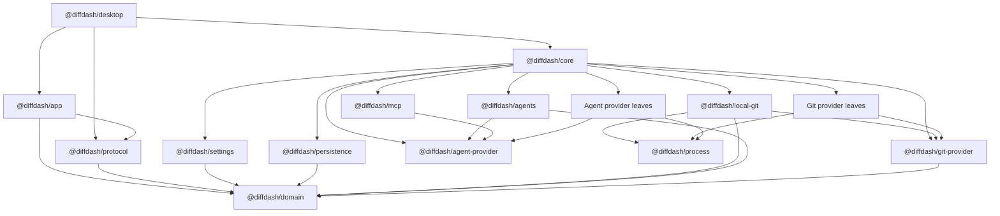

# Architecture

DiffDash is a pnpm workspace with an Electron native-host composition root and one embedded Core
business runtime. Package boundaries separate domain, platform, host orchestration, and concrete
integrations; they are enforced by
`scripts/build/package-boundaries.test.mjs`.

## Package Graph

Arrows point from a consumer to an allowed dependency. External libraries are omitted.

```mermaid
graph TD
  desktop["@diffdash/desktop"] --> core["@diffdash/core"]
  desktop["@diffdash/desktop"] --> app["@diffdash/app"]
  desktop --> protocol["@diffdash/protocol"]
  core --> settings["@diffdash/settings"]
  core --> persistence["@diffdash/persistence"]
  core --> localGit["@diffdash/local-git"]
  core --> agents["@diffdash/agents"]
  core --> mcp["@diffdash/mcp"]
  core --> gitSdk["@diffdash/git-provider"]
  core --> agentSdk["@diffdash/agent-provider"]
  core --> gitProviders["Git provider leaves"]
  core --> agentProviders["Agent provider leaves"]

  app --> protocol
  app --> domain["@diffdash/domain"]
  protocol --> domain
  settings --> domain
  persistence --> domain
  localGit --> domain
  localGit --> gitSdk
  localGit --> process["@diffdash/process"]
  agents --> domain
  agents --> agentSdk
  mcp --> agentSdk
  gitSdk --> domain
  gitProviders --> gitSdk
  gitProviders --> process
  agentProviders --> agentSdk
  agentProviders --> process
```

`@diffdash/e2e` is a product-test leaf that launches compiled or packaged `@diffdash/desktop`.
`@diffdash/web` is an independent web product. `tools/*` consumes browser-safe product exports for
demo and promotional output but is never shipped in the desktop application.

## Allowed Directions

- `@diffdash/domain` is the lowest product model layer and imports no platform or provider package.
- `@diffdash/protocol` depends only on browser-safe domain contracts and Effect. It never imports
  Electron, Node, persistence, or a concrete provider.
- `@diffdash/app` is browser-safe. Renderer code reaches privileged capabilities only through the
  typed protocol implemented by preload.
- `@diffdash/process`, `@diffdash/settings`, and `@diffdash/persistence` own subprocess, JSON, and
  SQLite infrastructure respectively. Persistence stores require Effect's generic `SqlClient`;
  runtime-specific Node and Bun adapters own SQLite startup, backup, and migrations. Process
  execution is exposed as one scoped Effect service; concrete command protocols remain outside the
  package. Electron supplies schema-validated plain runtime configuration at the Core boundary.
- `@diffdash/git-provider` and `@diffdash/agent-provider` own provider-neutral contracts,
  registries, errors, and conformance suites. They never import concrete providers.
- `@diffdash/agents` owns provider-neutral walkthrough and review-thread engines. Its two explicit
  exports depend only on `@diffdash/agent-provider`, `@diffdash/domain`, and Effect; Core supplies
  resolved provider context and retains routing, persistence, target resolution, workspace leases,
  MCP access, progress, and transaction ownership.
- `@diffdash/mcp` is the sole MCP SDK owner. It exposes loopback HTTP lifecycle, scoped bearer
  capabilities, request decoding, tool registration, bounded output, and cleanup, while Core supplies
  a typed handler bundle. It never imports persistence, process, local-git, Core, or review-domain
  implementation services.
- Concrete provider packages are inward-facing leaves. They may depend on their SDK, Effect,
  `@diffdash/process` when needed, and provider-owned libraries. They never depend on desktop,
  renderer, protocol, settings, persistence, orchestration, or another concrete provider.
- Provider-neutral orchestration may depend on SDKs and infrastructure, but not concrete providers.
- `@diffdash/core` owns the single business `ManagedRuntime`, service Layer graph, and concrete
  provider registration, review-thread anchor mapping, prompt construction, artifact normalization,
  deterministic review ordering, and offset pagination. Its public `core.ts` entrypoint is an
  export-only facade; internal code depends on the closed `core-contract.ts` leaf instead of
  importing the public entrypoint. Core imports no Electron, updater, renderer, or desktop modules.
- `@diffdash/desktop` owns windows, preload security, dialogs, shell integration, the updater,
  single-instance behavior, and embedded Core lifecycle.

The desktop build has two explicit main-process composition roots. Normal `build`, `pack`, and
`dist` tasks select the production entrypoint, which contains no E2E environment-controlled policy
or fixture providers. Playwright tasks select the `e2e` build mode and its separate entrypoint,
which may decode `DIFFDASH_E2E_*` values and composes Core's fixture-provider export. The E2E
entrypoint and fixture provider implementations are not reachable from the production main bundle.

Dependencies must remain acyclic and use `workspace:*`. Relative imports cannot cross package
roots. Browser-safe exports are bundled in a browser target during the boundary test to reject Node,
Electron, SQLite, and concrete-provider leakage.

## Runtime Trust Boundary

Providers are built into DiffDash and reviewed and released with the desktop application. A package
boundary is an ownership, test, and dependency boundary, not runtime sandboxing. Concrete provider
code executes as trusted code in the embedded Core and can use capabilities explicitly passed by
Core composition. Do not treat the package model as safe plugin loading for untrusted third-party
code.

## Embedded Core Migration

Electron controllers call the closed `CoreMethod` catalog and the Core-owned walkthrough operation
facade. Internal Effect tags, Layers, and the managed runtime are not exposed to Electron. Boundary
tests reject direct business-service imports and generic runtime execution from controllers.
Each Core call returns `CoreResult<Value, Failure>` with an exact method-correlated expected failure
union. The Electron application-runtime adapter deliberately unwraps that result into the existing
IPC error adapters; only defects reject directly from `EmbeddedCore`.

The host must call `start` before any business operation. Concurrent and repeated startup calls
share one acquisition, startup failures are normalized to Core-owned errors, and repeated disposal
shares one cleanup. Calls made before startup, during disposal, or after disposal return a typed
`CoreLifecycleError`; they never acquire a second runtime implicitly. Electron installs graceful
shutdown ownership before Core startup so partial startup is still disposed.

Native-host configuration is schema-decoded once. Optional paths, environment values, fixtures,
repository lookups, and cached artifacts use `Option` inside Core and persistence. Existing Electron,
IPC, SQLite, and encoded configuration contracts remain nullable only at their boundaries. Analytics
and fixture availability use closed states rather than independent nullable or boolean fields.

The renderer treats the context-bridged `DiffDashApi` as an encoded transport, not an application
service. One internal `PreloadClient` owns `window.diffDash`; renderer features depend on cohesive
Effect services for repositories, project targets, preferences, review content, review automation,
and Electron-shell capabilities. Their independent Layers are composed once into one atom-owned
runtime. The adapters re-decode structured-cloned responses, restore ordinary absence as `Option`,
translate callback subscriptions into scoped streams, and expose typed renderer failures. A package
boundary test rejects direct bridge access from production feature code.

Core operations return owner-domain failures, not `TransportError`. Electron maps those failures to
the established public IPC codes at the controller boundary. Conversely, unsolicited updater,
thread-progress, window, and navigation events use one checked best-effort sender: encoding and
payload violations remain visible, while a renderer destroyed during delivery cannot fail the
owning workflow.

| Ownership | Current boundary |
| --- | --- |
| Repositories, project workspace, settings, prerequisites, analytics | Named Core operations |
| Review acquisition, paging, search, viewed state, navigation resolution | Named Core operations |
| Review agents and threads | Named Core operations with host progress callbacks |
| Walkthrough execution and persistence | `start`, `getOperation`, `cancel`, and `getStored` |

SQLite is authoritative for accepted, active, and terminal walkthrough operations. Core persists
acceptance before provider execution, uses guarded state versions to choose one terminal winner, and
loads successful content from `WalkthroughStore` through the persisted artifact reference. The
scoped `FiberMap<WalkthroughOperationId>` contains active workers only; completed fibers leave it
automatically, and no terminal `Deferred` registry or fixed in-memory history limit exists. Repeated
non-regenerate starts attach to the persisted exact review generation and prompt version, while
regeneration durably supersedes matching prior work. Startup marks active rows from a dead Core epoch
as interrupted and never restarts provider work automatically.

Updater, window, dialog, shell, IPC sender validation, and renderer transport remain Electron-owned.
FUN-254 continues with renderer-visible replay and cross-process diagnostics without moving
orchestration back into Electron.

The remaining Electron imports of Core-owned error types are temporary transport adapters with
explicit migration owners:

| Electron adapter | Migration owner |
| --- | --- |
| `ipc/walkthrough-public-error.ts` | FUN-254 moves walkthrough failure classification and diagnostics behind the durable Core operation boundary |
| `ipc/review-thread-public-error.ts` | FUN-215 moves review-thread failure envelopes behind external Core RPC during atomic cutover |
| `ipc/public-error.ts` | FUN-215 moves remaining domain-to-transport failure envelopes behind external Core RPC during atomic cutover |

See [Git provider authoring](git-provider-authoring.md) and
[agent provider authoring](agent-provider-authoring.md) for extension contracts.
